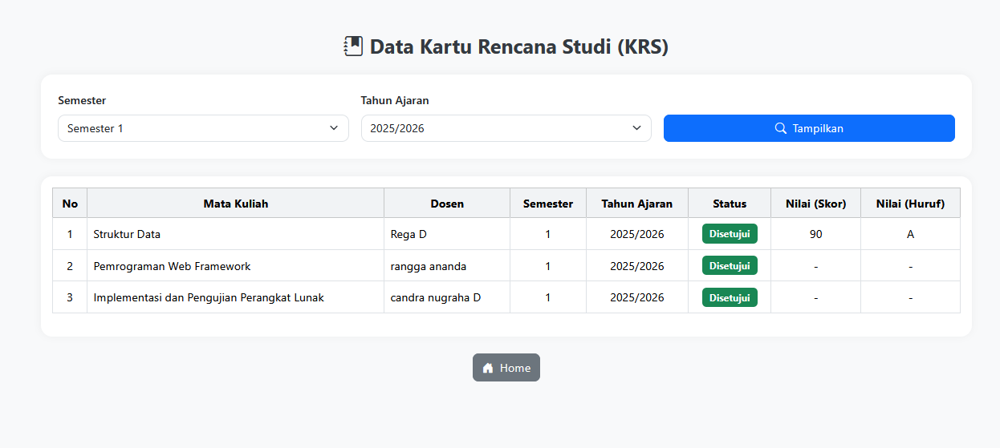
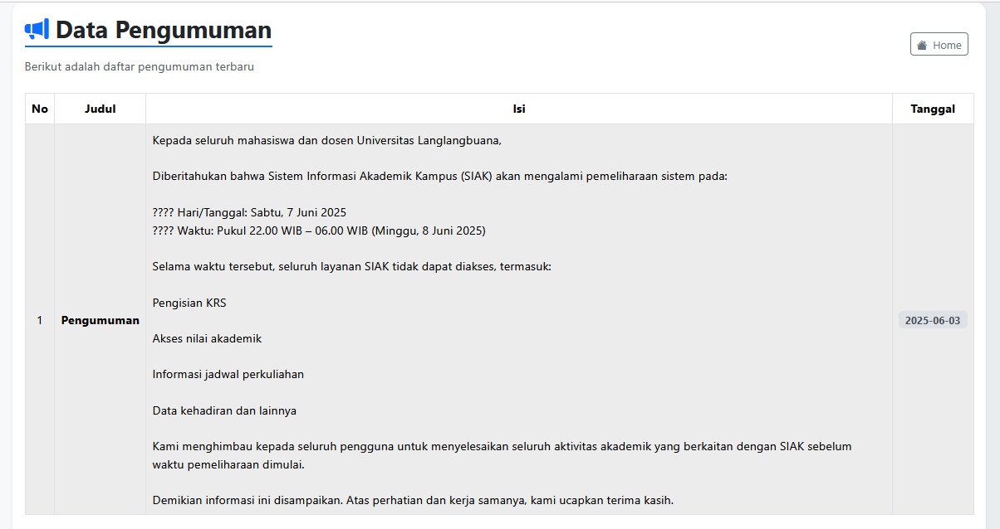

# Sistem Data Mahasiswa

Aplikasi CRUD Data Mahasiswa menggunakan PHP dan MySQL.

## Fitur
- Tambah data mahasiswa
- Edit data mahasiswa
- Hapus data mahasiswa
- Cari data mahasiswa

## Teknologi
- PHP
- MySQL
- Bootstrap
- XAMPP

## Cara Menjalankan
1. Clone repository
2. Import database ke MySQL
3. Jalankan Apache dan MySQL di XAMPP
4. Buka http://localhost/datamahasiswa

## Screenshot

## Screenshot

### Halaman Login

### Dashboard

### Kartu Rencana Studi (KRS)

### Data Pengumuman

### Laporan Nilai Mahasiswa

